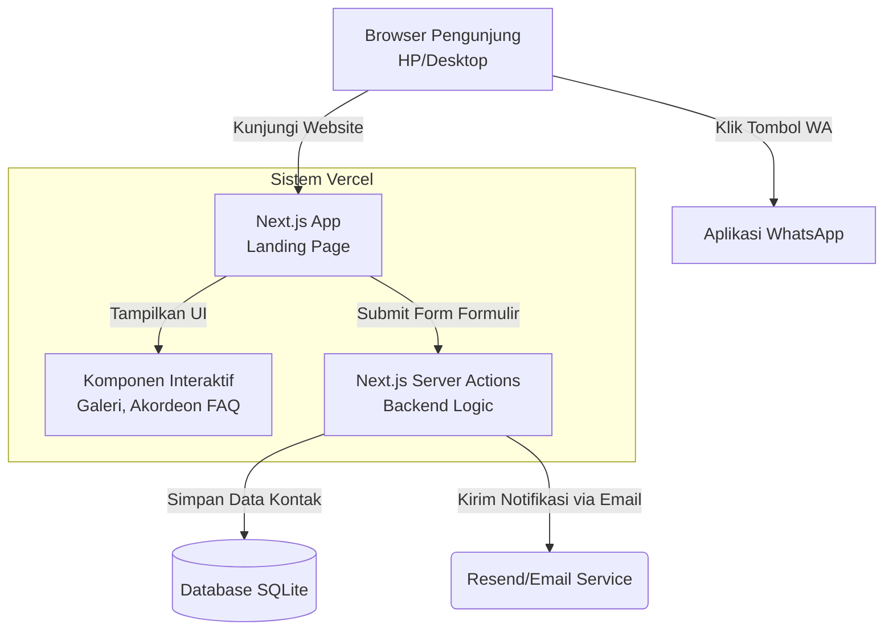
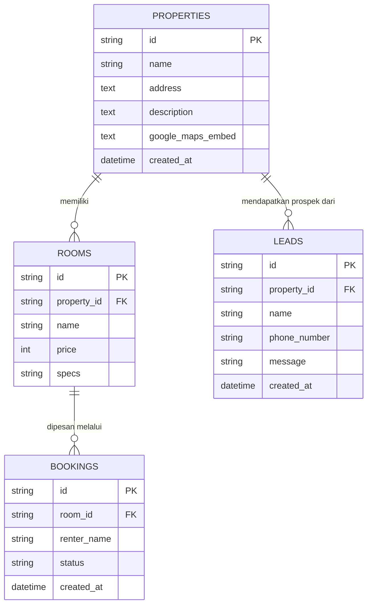

# PRD — Project Requirements Document

## 1. Overview
Aplikasi ini adalah sebuah *landing page* properti berkelas premium untuk bisnis kost. Platform ini dirancang dengan arsitektur multi-properti, sehingga satu *landing page* dapat menampung dan menyajikan beberapa properti kost yang berbeda dalam satu atap digital. Mekanisme pemilihan properti disediakan di bagian paling atas halaman (sebuah *Property Selector*) sehingga pengunjung dapat dengan mudah beralih melihat-lihat detail properti yang mereka inginkan tanpa meninggalkan situs. Untuk Fase 1 (MVP), pilihan properti akan berisi satu properti default—menyederhanakan pengalaman awal tanpa mengorbankan fondasi multi-properti yang akan diperluas di fase selanjutnya.

Tujuan utama aplikasi ini adalah menggantikan ketergantungan pada platform agregator pencarian kost (seperti Mamikos) dengan memberikan kontrol penuh kepada pemilik atas presentasi merek dan informasi. Dengan desain antarmuka (UI) dan pengalaman pengguna (UX) setara merek-merek ternama, *landing page* ini dirancang untuk menyajikan informasi fasilitas secara sangat lengkap, visual yang memukau, hingga kemudahan bagi calon penghuni untuk mengetahui keunggulan kost tanpa harus datang langsung (survei fisik). Konversi utama yang diharapkan adalah calon penghuni menghubungi pemilik via WhatsApp atau formulir, sebelum ke depannya berkembang menjadi platform pemesanan kamar mandiri.

## 2. Requirements
- **Desain Kelas Atas (Premium UI/UX)**: Estetika modern, elegan, minimalis, dan menggunakan animasi transisi yang halus layaknya website produk kelas dunia.
- **Responsivitas Penuh**: Harus tampil sempurna dan memuat dengan cepat di perangkat seluler (mobile-first), tablet, dan desktop.
- **Biaya Operasional Rp0 (Free Stack)**: Menggunakan kombinasi teknologi dan layanan komputasi awan yang menyediakan lapis gratis (*free tier*) yang sangat memadai untuk jangka panjang.
- **SEO & Performa Tinggi**: Waktu muat (*loading time*) harus sangat cepat dan teroptimasi untuk mesin pencari agar kost mudah ditemukan di Google.
- **Media Visual yang Kuat**: Kemampuan menampilkan foto beresolusi tinggi, pemutaran video, dan di masa depan mendukung integrasi *embed* Tur Virtual 360°.

## 3. Core Features
Fitur-fitur ini disusun berdasarkan peta jalan (*roadmap*) pengembangan untuk mencapai visi akhir.

### Fase 1 (MVP - Versi Pertama)
- **Pemilih Properti (Property Selector)** — Terletak di bagian paling atas halaman (header) untuk memungkinkan pengunjung memilih properti kost yang ingin ditampilkan. Mendukung arsitektur multi-properti; pada Fase 1 opsi yang tersedia hanya satu properti default agar pengalaman awal tetap sederhana tanpa menghilangkan fondasi perluasan di fase berikutnya.
- **Tampilan Utama & Keunggulan** — Bagian pembuka dengan foto utama, headline menarik, dan sorotan kelebihan kost.
  - Hero Banner: *Headline* menarik, foto latar berkualitas, dan tombol utama penyewaan.
  - Sorotan Keunggulan: Daftar keunggulan utama kost dengan ikon pendukung yang elegan.
- **Galeri Foto & Video** — Koleksi visual foto dan video untuk memperlihatkan seluruh fasilitas kost.
  - Galeri Foto: Kumpulan foto seluruh fasilitas kost yang ditata dengan tata letak (*layout*) modern.
  - Galeri Video: Video tur singkat memperlihatkan suasana kost.
- **Daftar Kamar & Harga** — Informasi lengkap tipe kamar, spesifikasi, dan harga sewa.
  - Tipe Kamar: Daftar tipe kamar yang tersedia beserta foto masing-masing.
  - Spesifikasi Lengkap: Rincian fasilitas di dalam kamar (ukuran, kasur, AC, dll).
  - Daftar Harga: Informasi harga sewa per tipe kamar secara transparan.
- **Fasilitas Umum** — Penjelasan fasilitas di area umum yang bisa digunakan semua penghuni.
  - Fasilitas Bersama: Daftar dan deskripsi fasilitas di area umum (dapur, ruang tamu, dll).
  - Ikon Ringkas: Tampilan ikon-ikon minimalis untuk menggambarkan fasilitas secara visual.
- **Lokasi** — Peta dan petunjuk arah menuju kost.
  - Peta Google: Peta interaktif yang menunjukkan poin lokasi kost.
  - Alamat & Akses: Alamat lengkap dan teks petunjuk arah terdekat dari jalan utama/fasilitas publik.
- **Testimoni Penghuni** — Ulasan dan rating dari penghuni yang sudah merasakan tinggal di kost.
  - Ulasan Tertulis: Testimoni asli dari penghuni yang sudah ada.
  - Rating Bintang: Skor penilaian (bintang 1-5) untuk membangun kredibilitas.
- **FAQ** — Jawaban atas pertanyaan yang sering diajukan calon penghuni.
  - Pertanyaan Umum: Daftar pertanyaan lazim terkait aturan, jam malam, parkir, dll.
  - Jawaban Akordeon: Jawaban yang bisa diklik untuk dibuka-tutup (*accordion*) agar hemat ruang.
- **Panggilan Aksi (CTA)** — Tombol dan formulir untuk memudahkan pengunjung menghubungi pemilik.
  - Tombol WhatsApp: Tombol aksi cepat untuk memulai percakapan instan (*chat*) dengan pemilik.
  - Formulir Singkat: Formulir pengisian data diri (nama, nomor HP) bagi yang ingin dihubungi balik.

### Fase 2
- **Tur Virtual** — Pengalaman menjelajah kost secara virtual 360° tanpa harus datang langsung.
  - Navigasi 360°: Pengalaman melihat-lihat dan memutar pandangan di dalam kost secara virtual.
  - Penjelajahan Ruangan: Tombol interaktif untuk berpindah dari satu ruangan ke ruangan lainnya.

### Fase 3
- **Proses Sewa** — Alur pemesanan kamar mulai dari pemilihan hingga pembayaran langsung di website.
  - Pilih Kamar: Pengguna bisa memilih tipe atau nomor kamar spesifik yang diinginkan.
  - Formulir Data Diri: Input data lengkap dokumen calon penyewa.
  - Konfirmasi & Pembayaran: Ringkasan pesanan dan instruksi/metode pembayaran online.

## 4. User Flow
1. **Langkah 1: Menemukan dan Tertarik (Hero Area)** — Pengunjung membuka *landing page*, disambut oleh judul besar yang menggugah dan foto/video latar belakang berkualitas premium.
2. **Langkah 2: Menjelajahi Ruang & Fasilitas** — Pengguna menggulir ke bawah, melihat galeri foto dan video suasana kost, lalu mencermati pilihan tipe kamar, fasilitas kamar, dan harga sewa.
3. **Langkah 3: Validasi Sosial & Lokasi** — Pengguna mengecek area peta untuk kepastian lokasi dan membaca ulasan (testimoni) positif dari penghuni yang sudah ada. 
4. **Langkah 4: Mengatasi Keraguan (FAQ)** — Pengguna membuka bagian FAQ untuk melihat jawaban dari pertanyaan-pertanyaan dasar seperti parkir atau aturan tamu.
5. **Langkah 5: Konversi (Tindakan Nyata)** — Pengguna sudah yakin, kemudian menekan tombol "Hubungi Kami". Mereka bisa memilih langsung tersambung ke WhatsApp pemilik atau mengisi formulir singkat agar dihubungi kembali.

## 5. Architecture
Untuk memastikan website berjalan cepat dan pengalaman transisi terasa premium tanpa interupsi, kita menggunakan pendekatan *Modern Web App* (Next.js). Halaman disajikan statis seoptimal mungkin untuk SEO, namun tetap memiliki fungsi dinamis untuk pengiriman formulir Kontak (*Leads*).

## 6. Database Schema
Walaupun pada Fase 1 fokus ke *Landing Page*, kita perlu menyiapkan struktur basis data sederhana untuk menyimpan data *Leads* (Prospek/Formulir) dan sebagai pondasi pengelolaan kamar menuju Fase 3 (Proses Sewa). Untuk mendukung visi multi-properti sejak awal, setiap entitas utama dikaitkan dengan properti tertentu melalui relasi.

- **properties** — Menampung setiap properti kost yang dikelola.
  - `id` (String/UUID) — Identifier unik properti
  - `name` (String) — Nama properti (misal: "Kost Premium Sudirman")
  - `address` (Text) — Alamat lengkap
  - `description` (Text) — Deskripsi singkat properti
  - `google_maps_embed` (Text) — Link embed Google Maps
  - `created_at` (Timestamp)
- **rooms** — Menyimpan data tipe kamar dan harganya secara sistematis, terhubung dengan sebuah properti.
  - `id` (String/UUID) — Identifier unik
  - `property_id` (String/UUID) — Relasi ke tabel `properties`
  - `name` (String) — Nama/Tipe kamar (misal: "Kamar Tipe A - Balkon")
  - `price` (Integer) — Harga sewa per bulan 
  - `specs` (Text/JSON) — Daftar fasilitas (AC, Luas Kasur, dll)
- **leads** — (Sangat penting di MVP) Menyimpan prospek/orang yang mengisi formulir untuk dihubungi, beserta properti yang sedang dilihat.
  - `id` (String/UUID) — Identifier unik
  - `property_id` (String/UUID) — Relasi ke properti yang dikirimkan saat form diisi
  - `name` (String) — Nama pengunjung
  - `phone_number` (String) — Nomor telepon / WhatsApp
  - `message` (Text) — Pesan atau tipe kamar yang diminati
  - `created_at` (Timestamp) — Waktu form diisi
- **bookings** (Untuk Fase 3) — Mencatat transaksi sewa masuk.
  - `id` (String/UUID)
  - `room_id` (String) — Relasi ke tabel `rooms`
  - `renter_name` (String) — Nama penyewa
  - `status` (String) — Status pembayaran (Pending, Paid, Cancelled)
  - `created_at` (Timestamp)

## 7. Tech Stack
Berikut adalah rekomendasi tumpukan teknologi modern yang **100% Gratis** (*free tier* pada layanan cloud) untuk melayani *landing page* dengan tingkat trafik awal hingga menengah, namun menawarkan keindahan antarmuka (*UI/UX*) setara website brand terkenal dunia:

- **Frontend & Backend (Meta Framework)**: **Next.js** (App Router). Kerangka kerja paling populer yang mencakup bagian depan (tampilan) sekaligus bagian belakang (API/Server Actions) dalam satu tempat. 
- **Desain & Styling (UI/UX)**:
  - **Tailwind CSS**: Untuk menyusun *layout* halaman dengan cepat dan responsif.
  - **shadcn/ui**: Kumpulan komponen UI siap pakai (seperti *buttons*, *accordion* FAQ, *cards*) yang berpenampilan minimalis, premium, dan ramah aksesibilitas.
  - **Framer Motion**: *Library* pilihan utama untuk memberikan efek animasi premium (seperti efek muncul secara statis/fade-in saat di *scroll*, perubahan gambar yang halus), sangat krusial untuk membuat web terasa 'mahal'.
- **ORM (Manajemen Database)**: **Drizzle ORM**. Lebih ringan, super cepat, dan memastikan pertukaran data (seperti formulir ke database) berjalan aman (tipe-datanya terjamin/Type-safe).
- **Database**: **SQLite (melalui layanan Turso)**. Sangat cepat, lapis gratisnya (*free tier*) amat besar (cukup untuk ratusan ribu prospek), dan sangat direkomendasikan untuk aplikasi skala MVP hingga menengah tingkat atas.
- **Notifikasi**: **Resend** (Layanan Email gratis hingga ribuan email/bulan) agar setiap kali ada yang mengisi form leads, pemilik langsung menerima notifikasi di email masuknya.
- **Deployment & Hosting**: **Vercel** (atau **Cloudflare Pages**). Sangat selaras dengan Next.js, lapis gratisnya menampung *traffic* pengunjung *landing page* yang masif secara gratis, dan memberikan SSL/HTTPS secara otomatis.

Aspek keamanan dan keandalan aplikasi dijaga secara menyeluruh melalui pendekatan berikut:

- **Validasi Input Server-Side**: Menggunakan **Zod** untuk memvalidasi seluruh input dari formulir CTA, mencegah injeksi data dan memastikan data yang masuk bersih serta sesuai format yang diharapkan.
- **Perlindungan CSRF**: Integrasi bawaan Next.js secara otomatis menangani token CSRF untuk setiap mutasi server, sehingga permintaan palsu antar situs tidak dapat mengeksploitasi endpoint.
- **Rate Limiting**: Menerapkan pembatasan laju permintaan pada endpoint formulir kontak/CTA menggunakan layanan seperti **Upstash Rate Limit** (gratis) melalui middleware Next.js, untuk menghindari spam dan penyalahgunaan.
- **Perlindungan SQL Injection**: **Drizzle ORM** menggunakan *parameterized queries* secara default, sehingga seluruh interaksi dengan database terbebas dari celah injeksi SQL.
- **Content Security Policy (CSP)**: Header HTTP ketat dikonfigurasi untuk membatasi sumber skrip, gaya, dan konten lainnya, melindungi aplikasi dari serangan XSS.
- **HTTPS Enforcement**: **Vercel/Cloudflare** secara otomatis menyediakan dan memaksakan koneksi HTTPS, menjamin seluruh data antara pengguna dan server terenkripsi dengan aman.